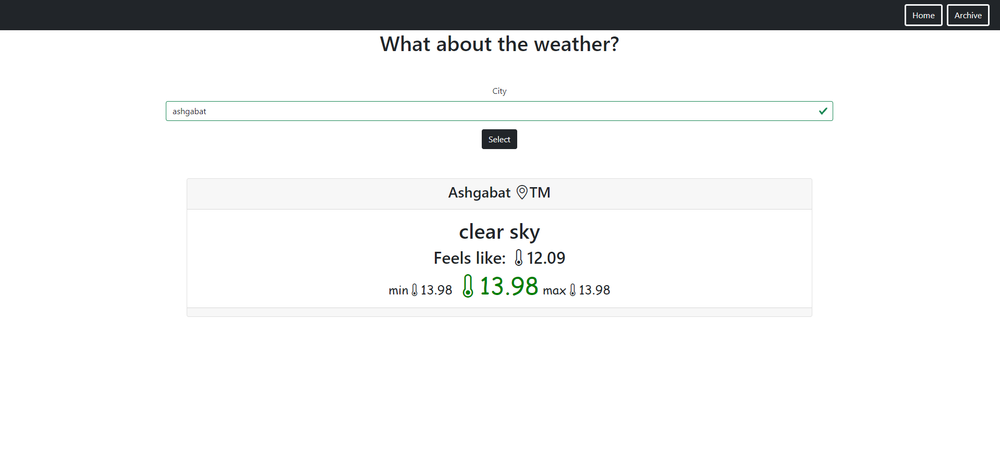
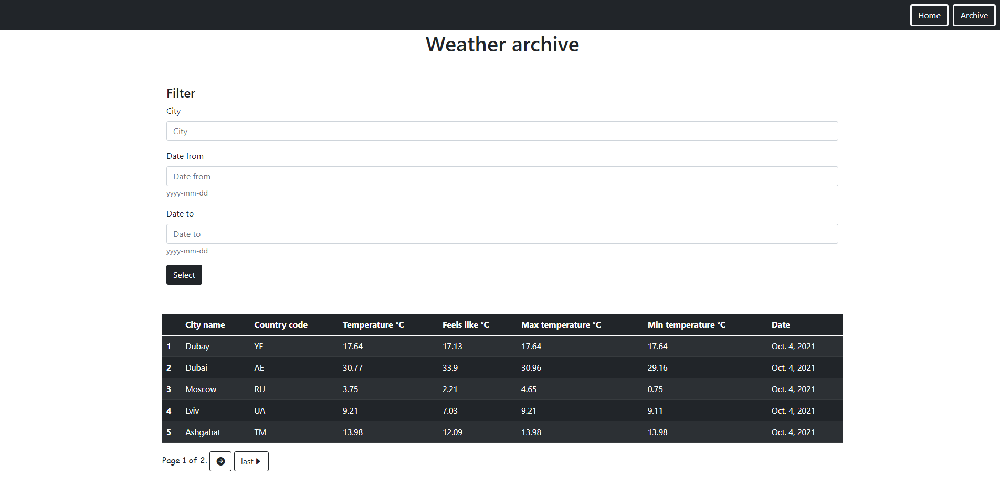
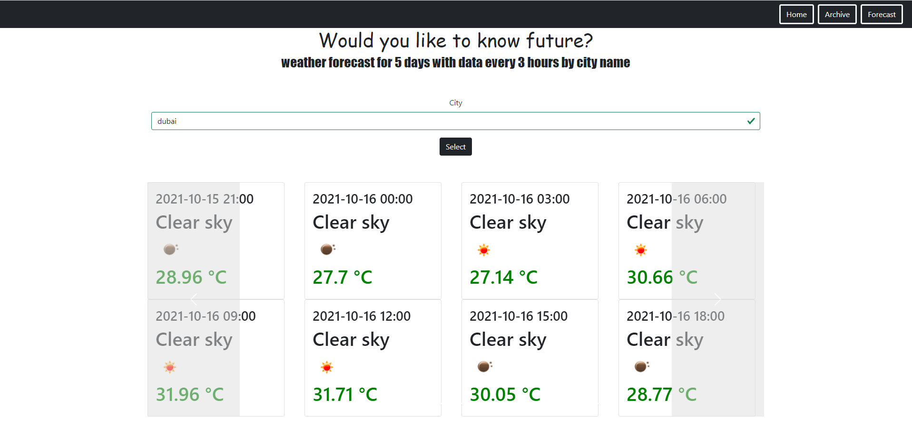

# Weather portal

The site allows you to find out the current weather of the entered city using the OpenWeatherAPI. There are three pages: home, forecast and archive. Data in archive can be sorted by 'city', 'date_to' and 'date_from'.

## For setting all requirements follow next command:
> pip install -r requirements.txt

> python manage.py migrate

All data stored in **SQLite**.

**_Homepage_**

**_Archive_**

**_Forecast_**
